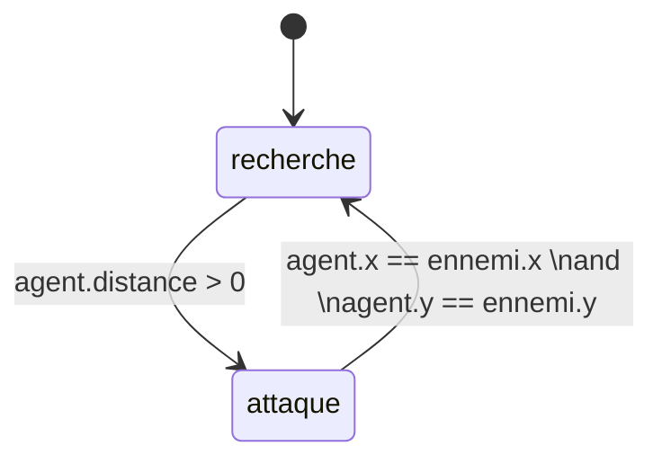
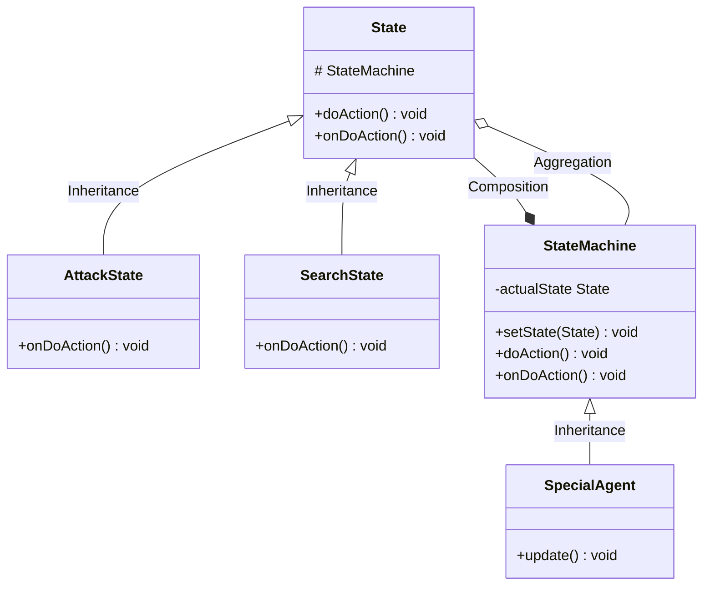
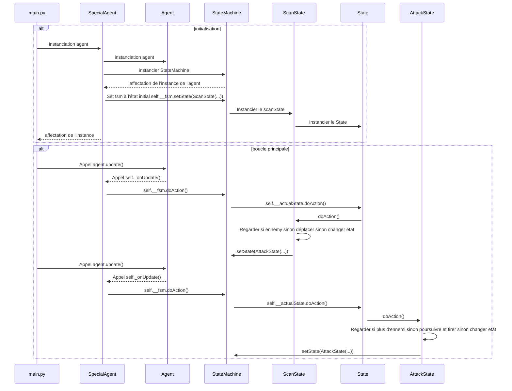

# Mermaid: State Machine

```mermaid
stateDiagram-v2
    [*] --> recherche
    recherche --> attaque : agent.distance > 0
    attaque --> recherche : agent.x == ennemi.x \nand \nagent.y == ennemi.y
```

https://refactoring.guru/design-patterns/state

```mermaid
classDiagram
    State <|-- AttackState: Inheritance
    State <|-- SearchState: Inheritance
    State: # StateMachine
    State: +doAction() void
    State: +onDoAction() void
    class AttackState{
      +onDoAction() void
    }
    class SearchState{
      +onDoAction() void
    }
    State --* StateMachine: Composition
    StateMachine --o State : Aggregation
    StateMachine <|-- SpecialAgent: Inheritance
    StateMachine: -actualState State
    StateMachine: +setState(State) void
    StateMachine: +doAction() void
    StateMachine: +onDoAction() void
    class SpecialAgent{
        +update() void
    }
```

```mermaid
sequenceDiagram
    alt initialisation
    main.py->>+SpecialAgent: instanciation agent
    SpecialAgent->>+Agent: instanciation agent
    SpecialAgent->>+StateMachine: instancier StateMachine
    StateMachine-->>+SpecialAgent: affectation de l'instance de l'agent
    SpecialAgent->>+StateMachine: Set fsm à l'état initial self.__fsm.setState(ScanState(...))
    StateMachine->>+ScanState: Instancier le scanState
    ScanState->>+State: Instancier le State
    SpecialAgent-->>main.py: affectation de l'instance
    end

    alt boucle principale
    main.py->>+Agent: Appel agent.update()
    Agent-->>+SpecialAgent: Appel self._onUpdate()
    SpecialAgent->>+StateMachine: self.__fsm.doAction()
    StateMachine->>+State: self.__actualState.doAction()
    State->>+ScanState: doAction()
    ScanState->>+ScanState: Regarder si ennemy sinon déplacer sinon changer etat
    ScanState->>+StateMachine: setState(AttackState(...))

    main.py->>+Agent: Appel agent.update()
    Agent-->>+SpecialAgent: Appel self._onUpdate()
    SpecialAgent->>+StateMachine: self.__fsm.doAction()
    StateMachine->>+State: self.__actualState.doAction()
    State->>+AttackState: doAction()
    AttackState->>+AttackState: Regarder si plus d'ennemi sinon poursuivre et tirer sinon changer etat
    AttackState->>+StateMachine: setState(AttackState(...))
    end
```